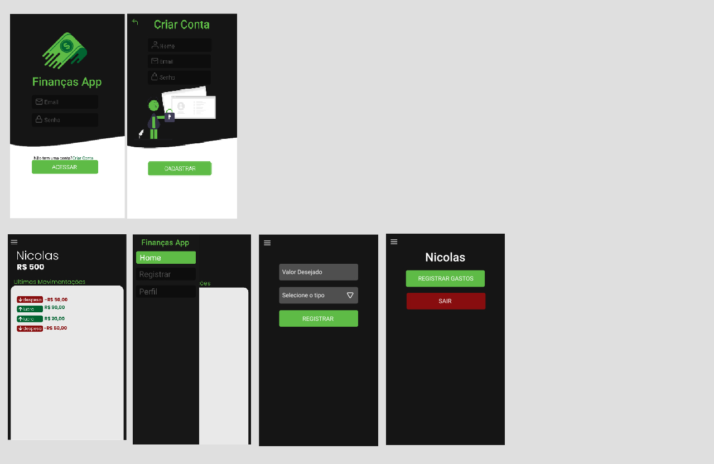

<h1 align="center">App de finanças 
</h1>

<h1>

</h1>

<h1>

</h1>

## **Sobre**📄

_É um projeto que particulamente eu gostei bastante de fazer, não é algo muito complexo mas no fim eu gostei bastante do resultado final!_

## **Tecnologias usadas**

- React Native
- Firebase
- Styled-Components

## **Como baixar o projeto?** 


```bash
$ git clone https://github.com/nikorasucodes/financas

$ cd financas

$ yarn install

$ yarn start
```

### _Desenvolvido por:_ **Nicolas Sousa**